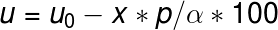
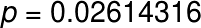
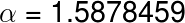
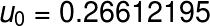
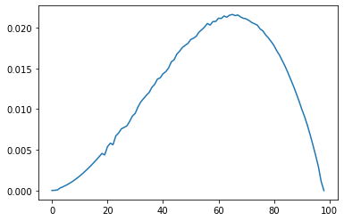

## Finding the model parameters of Dispersion using Tensorflow

The aim of this exercise is to develop a performance optimized model in C++ using basic GNU compiler features such as OpenMP and OpenMPI, as well as Linux pthreads, or fork

Dispersion is a macroscopic phenomenon that is caused due to a pressure wave. To find the dispersion relation for momentum conservation, we send a time series signal for time `t` over a distance of `x` units from one end to the other end with a finite length. Dispersion is not a controlled phenomenon, hence it uses the concepts of diffusion. 

Navier Stokes is a popular technique for generalising fluid flow. The exercise here uses Navier Stokes equation by considering isotropic pressure and absence of any shear force across walls or among the layers of fluid. 

## Initial Model evaluation

The initial model evaluation is provided in `dispersion.py` Python module. 

Run the command

- `python dispersion.py`

to view the plots of: 

    - input time series, 
    - estimated navier stokes relation
    - actual computed navier stokes relation

## Model calibration

Gradient Optimization in Machine Learning minimises the loss between observed values and expected values. It does so by minimizing the gradient of its cost function to a required minimum, or after several iterations of the process. With the derived equation, variables are set on:

- `position`
- `probability`
- `damping rate`
- `no. of units per cell`

During the calibration process the input velocity is set as a constant value obtained from the initial model evaluation.

## Choice of input time series

The input time series is taken to be a steadily increasing flow to model the fluid's experienced force. The fluid follows Navier Stokes relation and dispersion such that with external stimuli the momentum is conserved within a segment of air. The input time series is taken to be:

- `t` ^ 5

## Model Parameters

#### Velocity Equation

#### Probability of movement

#### Initial velocity

## Results

#### Input Time Series

The input times series is a steadily increasing power series function that starts from zero velocity. Considering the fact that the units per cell within a strech of the chosen analysis context, keep decreasing at a linear fashion, this signal is applied to the momentum conservation model.

---------------------

- **The Navier Stokes relation which is estimated from the given equation is:**

The estimated model derived from Gibb's free energy and Fick's law for diffusive flux, applies a volumetric relation. Each point in the estimated model is a navier stokes momentum relation or the force term. 

The residual change of density parameter is taken to be a constant value throughout our analysis context. This can ideally be harmonic in nature due to propagation of sound waves. 

- **The Tensorflow model which is predicted using Gradient Optimization from the Navier Stokes relation and the computational model is:**

The trained model given above equates to the estimated model with a tolerance vlue of `95e-4` for every data point excluding the last point. In training the model the volumetric units per cell which steadily increases and then decreases similar to the estimated model.

- **For calibrating the model, units per cell parameter has been used which relates to number of air particles in the estimated relation over a length `l`**

Units per cell between bounded areas showing the intervals, as it starts from a value of 1 and then adjusts itself to the predicted units per cell

The Volumetric Units per cell within the interval as given below reflects the exact structure of the estimated model, the other parameters that are relevant here are: a decreasing coefficient applied to units per cell and the double derivative of the time series: `t ^ 3`.

