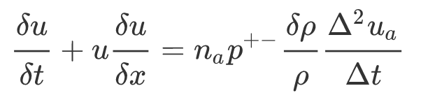

## Finding the model parameters of Dispersion using Tensorflow

The aim of this exercise is to develop a performance optimized model in C++ using basic GNU compiler features such as OpenMP and OpenMPI, as well as Linux pthreads, or fork

Dispersion is a macroscopic phenomenon that is caused due to a pressure wave. To find the dispersion relation for momentum conservation, we send a time series signal for time `t` over a distance of `x` units from one end to the other end with finite length. Dispersion is not a controlled phenomenon, hence it uses the concepts of diffusion. 

Navier Stokes is a popular technique for generalising fluid flow. The exercise here uses Navier Stokes equation by considering isotropic pressure and absence of any shear force across walls or among the layers of fluid. 

## Initial Model evaluation

The initial model evaluation is provided in `dispersion.py` Python module. 

Run the command

- `python dispersion.py`

to view the plots of: 

    - input time series, 
    - estimated navier stokes relation
    - actual computed navier stokes relation

## Model calibration

Gradient Optimization in Machine Learning minimises the loss between observed values and expected values. It does so by minimizing the gradient of its cost function to a required minimum, or after several iterations of the process. With the derived equation, variables are set on:

- `position`
- `probability`
- `damping rate`
- `no. of units per cell`

During the calibration process the input velocity is set as a constant value obtained from the initial model evaluation.

## Choice of input time series

The input time series is taken to be a steadily increasing flow to model the fluid's experienced force. The fluid follows Navier Stokes relation and dispersion such that with external stimuli the momentum is conserved within a segment of air. The input time series is taken to be:

- `t` ^ 5

## Results

#### Input Time Series

---------------------

- **The Navier Stokes relation which is estimated from the given equation is:**

- **The Tensorflow model which is predicted using Gradient Optimization from the Navier Stokes relation and the computational model is:**

- **For calibrating the model, units per cell parameter has been used which relates to number of air particles in the estimated relation over a length `l`**

